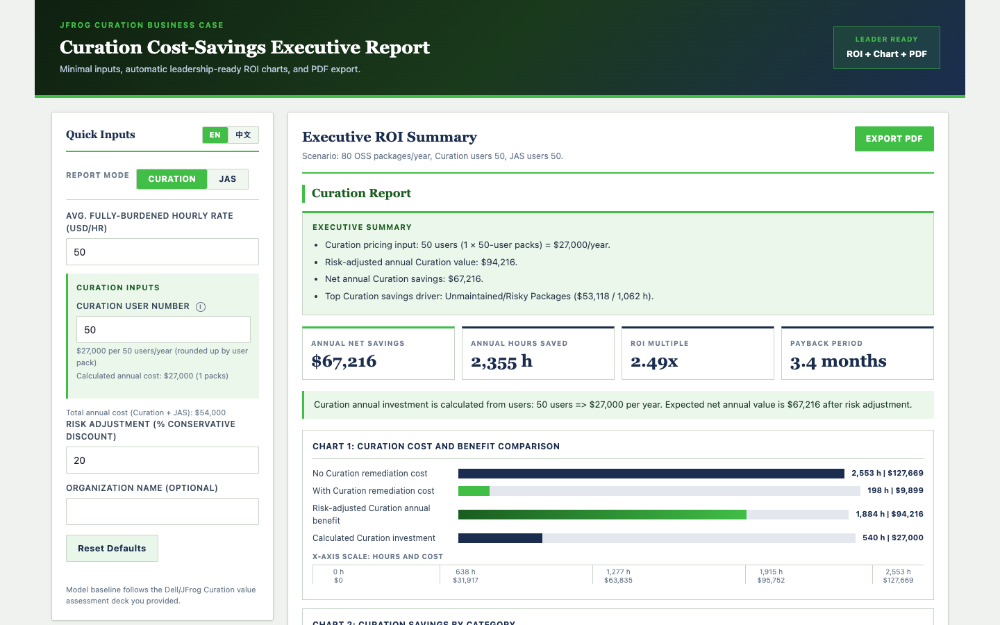

# JFrog Security ROI Calculator



A single-page tool that generates leadership-ready ROI reports for **JFrog Curation** and **JFrog Advanced Security (JAS)**. Enter a few inputs and get KPI cards, bar charts, and a one-click PDF export — no build step, no backend.

Supports **English / 中文** language toggle.

---

## Quick Start (Local)

**Requirements:** Python 3 (pre-installed on macOS/Linux) or any static file server.

```bash
# Clone or download the project
cd jfrog-security-roi

# Start a local server on port 8080
nohup python3 -m http.server 8080 > /tmp/jfrog-roi-http.log 2>&1 &
echo $! > /tmp/jfrog-roi-http.pid
```

Then open your browser at:

```
http://localhost:8080
```

To use a different port:

```bash
python3 -m http.server 3000   # → http://localhost:3000
```

---

## Files

| File | Description |
|---|---|
| `index.html` | App shell and layout |
| `styles.css` | JFrog green theme, Gartner-style panels |
| `app.js` | Calculation engine, chart rendering, i18n |

No npm, no bundler, no dependencies to install. The only external resource is `html2pdf.js` loaded from a CDN for PDF export.

---

## How to Use

1. **Select report mode** — choose Curation or JAS from the toggle in the left panel.
2. **Enter inputs:**
   - **Hourly Rate** — avg. fully-burdened engineer cost (USD/hr). Default: $50.
   - **User count** — number of licensed users (billed in packs of 50).
   - **Risk Adjustment** — conservative discount applied to gross benefit. Default: 20%.
   - **Organization Name** (optional) — appears as "Prepared for: …" in the report.
3. **Read the report** — KPI cards, executive summary, and bar charts update instantly.
4. **Export PDF** — click **Export PDF** to download a formatted A4 PDF.

---

## Model Baseline

Calculations are derived from the Dell/JFrog Curation value assessment deck (9,500 developers, 15,200 OSS packages/year, $57.60/hr baseline). User count and hourly rate inputs scale all values proportionally.
